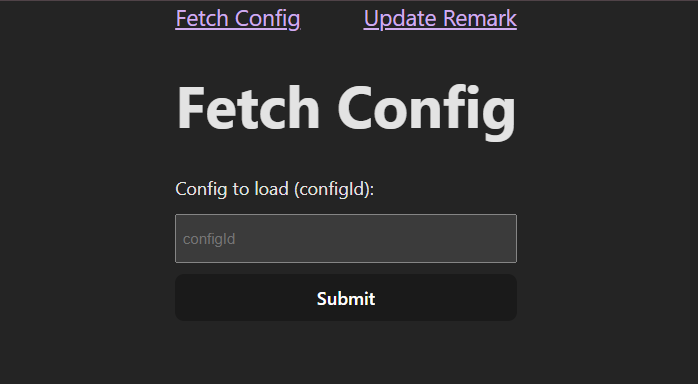
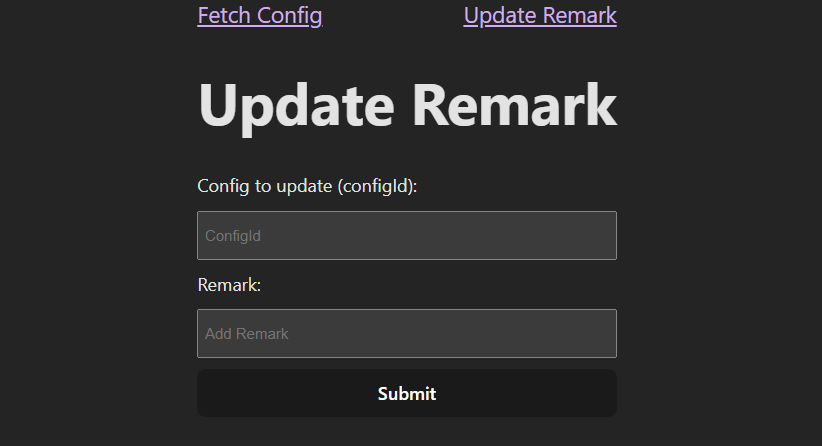

# FullStack Assignment – React + Express + MongoDB

This project is the solution for the **Full-Stack Software Developer Trainee Assignment (CodeRower Software Pvt Ltd)**.  
It contains:

- **Frontend**: React (Vite) + React Router + Fetch API  
- **Backend**: Express + Mongoose + MongoDB Atlas  
- **Error handling** and clean folder structure

---

## 📂 Project Structure

project-root/
┣ backend/ # Express + Mongoose
┃ ┣ src/
┃ ┃ ┣ controllers/
┃ ┃ ┣ models/
┃ ┃ ┣ routes/
┃ ┃ ┣ middleware/
┃ ┃ ┗ server.js
┣ frontend/ # React + Vite + React Router
┃ ┣ src/
┃ ┃ ┣ pages/
┃ ┃ ┣ App.jsx
┃ ┃ ┗ main.jsx
┣ screenshots/ # Project screenshots
┣ package.json # root scripts to run both
┗ README.md


---

## 🚀 Setup Instructions

### 1. Clone Repo
```bash
git clone https://github.com/Raqib-Ali/fullstack-assignment.git
cd fullstack-assignment
```

### 2. 🚀 Install Dependency
Install both backend & frontend dependencies in one go:
```bash
npm run install-all
```

### 3. Configure Environment
Create a .env file inside the backend/ folder:
```bash
MONGO_URI=YOUR_MONGO_URI
PORT=8080
MONGO_URI=YOUR_MONGO_URI
PORT=PORT_OF_YOUR_CHOICE
```

### 4. Run Project
Start both backend and frontend together:
```bash
npm run dev
```
- **Backend** → http://localhost:8080

- **Frontend** → http://localhost:5173

---

## 📸 Screenshots

- **Fetch Config Page** 



Fetch configuration by configId and display its 2D data array.

---
- **Update Remark Page**



Update the remark for a configuration by entering its configId.
        


